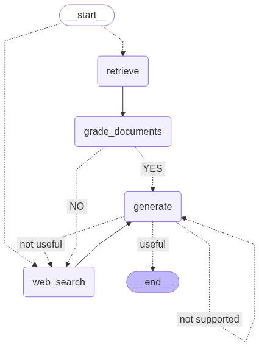
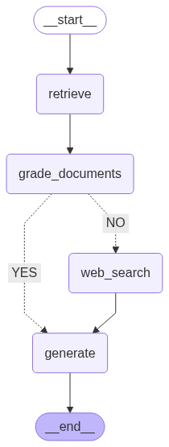
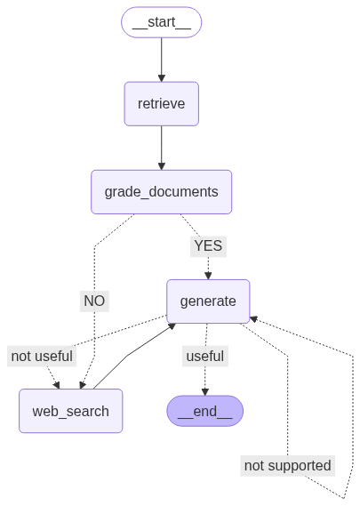

## 🛠️ Technologies
- Python 3.10+  
- Bibliothèques ML/IA (transformers, langchain, langgraph etc.)  

## 📊 Graphiques

### Architecture Adaptive RAG

### Architecture CRAG

### Architecture Self-RAG

## 🔮 Prochaines étapes
- Ajouter des benchmarks de performance.  
- Intégrer des datasets réels pour tester les différentes variantes.  
- Documenter plus en détail chaque module.  

---

✍️ **Auteur** : Mustapha  
📌 **Statut** : Prototype / expérimental
